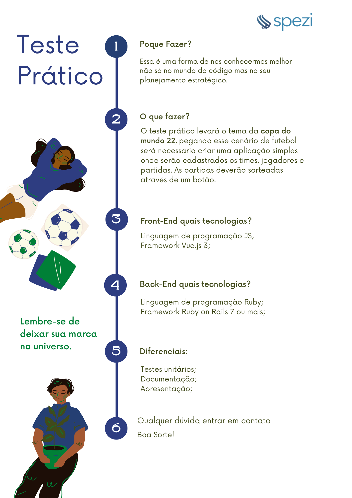

  

  # Desafio COPA

Considerações Wagner
<ul>
<li>- Utilizei para o projeto: Ambiente WSL2 - Ubuntu , Rails 7 (modo API), VueJS e Vite - A pasta raiz é do rails, o VueJS está na pasta /client </li>
<li>- Na pasta raiz executar - rails s  e na pasta client executar - npm rum dev </li>
<li>- Das tecnologias usadas, tenho mais experiência com o backend já que o VueJS eu apenas li algumas coisas quando estava na versão 2 com Quasar framework, então essa experiência foi ótima para me atualizar um pouco.</li>
<li>- Nunca foi desculpa, mas eu gostaria de observar que por estar trabalhando em horário comercial, o tempo ficou curto, eu tentei e não consegui no tempo acordado, mas eu gostaria de ter finalizado alguns detalhes como: ter criado Modal para os formulários e mensagens (erro/sucesso/etc), ter adicionado uma biblioteca UI (tentei a Bulma, Element Plus, olhei Quasar) para o frontend ficar apresentável e parecido com as imagens disponibilizadas de exemplo. Também queria ter deixado no backend as relaçoes melhor estabelecidas entre as models Equipes - Partidas, talvez até aumentado a modelagem com mais tabelas como equipe_jogadores / partida_detalhes / partida_gols... </li>
<li>- Experiência intensa, incrível e no meu caso enriquecedora porque aprendi bastante coisas aqui! Muito bom! (chorando um pouco, com mais 1/2 dias acredito que finalizaria a maioria das coisas que pretendia...kkk)</li>
<li>- Segue link de algumas imagens do projeto - https://drive.google.com/drive/folders/1jn-fwtlmoau-j94v14g6WL11l96l9vF9?usp=share_link</li>
<li>- Obrigado!</li>
</ul>

O desafio é bem simples. Para participar, basta criar um fork deste repositório e quando finalizar o desenvolvimento, abrir um merge request que iremos avaliar.

## Referências

Segue abaixo link com as referências do teste ser implementado.

<a href="https://www.figma.com/file/8W6h2rmhyrfsLEgfX7Axux/Teste-DEV---Spezi-Tecnologia?node-id=1%3A14" target="_blank">Design</a>

  
Clique aqui para ver detalhes do desafio

  

## Importante
Se surgir qualquer dúvida durante o desenvolvimento, não hesite em perguntar! nosso time vai estar pronto a lhe auxiliar 😊
